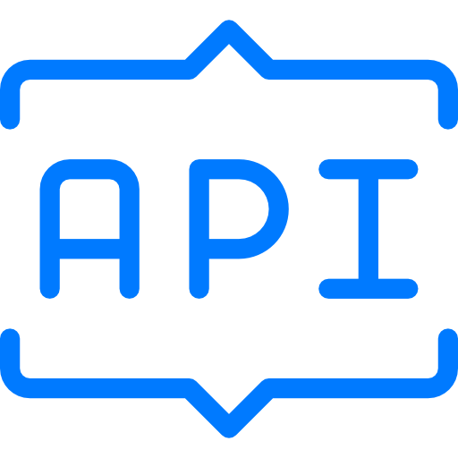

<!-- PROJECT LOGO -->
<br />
<p align="center">
  <a href="https://github.com/zalbani-lab/API-Template">
    
  </a>

  <h3 align="center">API Template</h3>

  <p align="center">
    Start developing what really matters
    <br />
    <a href="https://github.com/zalbani-lab/API-Template"><strong>Online example »</strong></a>
    <br />
    <br />
    <a href="https://api-platform.com/">View Documentation</a>
    ·
    <a href="https://github.com/zalbani-lab/API-Template">Report Bug</a>
    ·
    <a href="https://github.com/zalbani-lab/API-Template">Request Feature</a>
  </p>
  <hr/>
</p>
<div align="center">

[![Forks][forks-shield]][forks-url]
[![Stargazers][stars-shield]][stars-url]
[![Issues][issues-shield]][issues-url]

</div>

## 🧐 About The Project <a name = "about"></a>

As its name indicates this repo is an API template to jumpstart your projects ! So that you can, start developing what really matters

Integrate:

- User and working jwt authentication + authorization
- Automatic update of the updatedAt field

### ⛏️ Built With

- [Symfony](https://symfony.com/)
- [API platform](https://api-platform.com/)
- [lexik/jwt authentication bundle](https://symfony.com/bundles/LexikJWTAuthenticationBundle/current/index.html)

## 🏁 Getting Started <a name = "getting_started"></a>

Follow these steps to get a local copy up and running.

### 🔧 Prerequisites

To proceed with the installation you must have previously installed :

- php (8.1 or higher)
- [composer](https://getcomposer.org/)
- [symfony cli (optional)](https://symfony.com/download)

### 🚀 Installation

1. Install dependencies

```sh
$ composer install
```

2. Create encryption Keys

```sh
$ php bin/console lexik:jwt:generate-keypair
```

3. Setup env variables in `.env`

You have to create a file named `.env` following `.env.example`
Take the time to replace the variables in this file so that it corresponds to your development environment (especially : `DATABASE_URL`)

4. Create and setup database

```sh
$ php bin/console doctrine:database:create
$ php bin/console doctrine:schema:create
$ php bin/console doctrine:migration:migrate
```

4. Run server

```sh
$ symfony serve
```

### 🎈 How to use

1. Create entity

```sh
$ php bin/console make:entity
```

2. Create database migration

```sh
$ php bin/console make:migration
```

3. Execute migration

```sh
$ php bin/console doctrine:migrations:migrate
```

## 🚧 Roadmap <a name = "roadmap"></a>

- [x] Add Authentication and security
- [ ] Add license
- [ ] Add an example for all type of authorization
- [ ] Add an example of an doctrine ENUM custom type
- [ ] Add an entity + associate enpoint + custom entry point
- [ ] Add some basic fixtures
- [ ] Write some basic tests
- [ ] Document the project file architecture
- [ ] Add postman endpoints collection
- [ ] Integration of tools to validate the quality of the code

## 📝 License <a name = "license"></a>

Distributed under the MIT License. See `LICENSE` for more information.

## ✍️ Authors <a name = "authors"></a>

Alban Pierson – [https://github.com/Zalbani/](https://github.com/Zalbani)

<!--
## 🎉 Acknowledgements <a name = "acknowledgement"></a>

- Hat tip to anyone whose code was used
- Inspiration
- References
-->

<!-- MARKDOWN LINKS & IMAGES -->
<!-- https://www.markdownguide.org/basic-syntax/#reference-style-links -->

[forks-shield]: https://img.shields.io/github/forks/zalbani-lab/API-Template?style=for-the-badge
[forks-url]: https://github.com/zalbani-lab/API-Template/network/members
[stars-shield]: https://img.shields.io/github/stars/zalbani-lab/API-Template?style=for-the-badge
[stars-url]: https://github.com/zalbani-lab/API-Template/stargazers
[issues-shield]: https://img.shields.io/github/issues/zalbani-lab/API-Template?style=for-the-badge
[issues-url]: https://github.com/zalbani-lab/API-Template/issues
